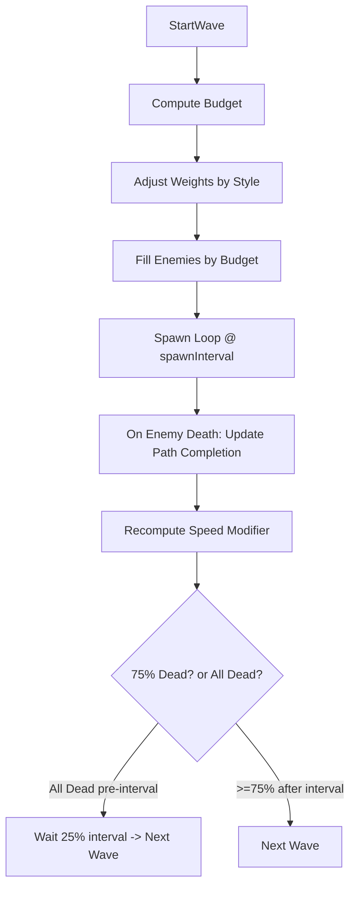

## Procedural Enemy Waves – Individual Strategy (400–500 words)

A fair and engaging spawning system should feel responsive to the player’s decisions while remaining predictable enough to learn. My approach balances three forces: the player’s defensive footprint (what they built), recent performance (how well the last wave went), and the geometry of the path (how long and contested it is). These signals flow into a budget-and-weights selector that decides not only how many enemies to send, but which archetypes, when to send them, and how quickly the next wave should arrive. Aditionally the number of waves is increased each level, based on the player's performance, testing their endurance.

### Scaling difficulty for consistent challenge
Each wave’s strength is set by an enemy budget derived from the player’s towers along that path, normalized path difficulty, and a performance multiplier. The tower-derived budget ensures strong fortifications invite stronger waves, while a difficulty factor (based on path overlap/length) prevents trivial routes from being empty. A performance multiplier (playerSkill) gently raises pressure after clean waves (no damage) and relents when the player takes noticeable damage, so difficulty trends toward a sweet spot over time. Wave pacing is also adaptive: a base `waveInterval` is increased once at startup by a small amount proportional to path length, and start timing is further controlled by completion-sensitive triggers (all dead early → short wait; otherwise ≥75% dead after interval).

### Adapting to player skill and play style
Skill adaptation uses a piecewise exponential function of recent health loss, with streak bonuses for consecutive damage-free waves. For budgeting it contributes as `(multiplier + wavesUndamaged/2)`; for speed tuning it uses `(multiplier + wavesUndamaged)`. Play style is inferred per path by comparing total tower max-health vs. offensive power (attack × speed × range). If the player is Defensive (more health), enemy damage is boosted (clamped); if Offensive (more DPS), enemy health is boosted (clamped). Selection weights are adjusted to emphasize counters without permanently altering prefab data: typical boosts are ×1.2 (Neutral/Offensive) and ×1.1 (Defensive). Additionally, a modest coin-based damage multiplier is applied (clamped to 1.2× max) to discourage hoarding and account for rebuild potential.

### Determining spawn locations
Spawners are placed procedurally alongside path generation. Each spawner binds to a path (sequence of subcells), and enemies spawn at that spawner’s transform, advancing along the assigned path. Because the spawning logic is path-aware, the system can compute speed, timing, and completion percentages meaningfully.

### Choosing which enemy to spawn and when
The system fills the wave until the budget is exhausted with a weighted random pick. Weights start from each prefab’s cached base likelihood and are multiplied by style weights, favouring effective enemies (typical boosts ×1.2 or ×1.1). Per-enemy modifiers (damage/health/speed) are applied at spawn with clamps for stability, and speed is updated mid-wave based on observed average path completion of defeated enemies. Spawned enemies currently receive `speedModifier × 0.5` at setup to keep pacing readable. The enemy types are also associated with player style, so an offense‑heavy style will cause more tanks to spawn.

### Cheatsheet of variables and formulas
- baseBudget = round(totalTowerCost) + coinBonus
  - totalTowerCost = Σ towerCost / (#paths tower participates in)
  - coinBonus = playerCoins / numTowerLocations
- difficultyFactor = clamp(0.75, totalPathDifficulty / pathCellCount, 1.25)
- playerSkill = multiplier + wavesUndamaged, where
  - x = damageFraction = clamp01((prevWaveStartHealth − currentHealth) / prevWaveStartHealth)
  - multiplier = −exp(8.04·(x−0.2)^5)+1 for x<0.2; 1 for x=0.2; −exp(1.1·(x−0.2)^5)+1 for x>0.2
  - currentHealth = 0.4·mainTowerHealth + 0.6·Σ pathTowers currentHealth
- enemyBudget = clamp(max(1, round(baseBudget × difficultyFactor × playerSkill)), min, max)
- spawnInterval(next wave) = (waveCompletionTime / enemyQuantity) × 0.3
- waveInterval = baseWaveInterval + 0.1 × pathLen  // applied once at startup; ongoing pacing is handled by next-wave triggers
- Next-wave trigger: if all dead before interval → wait 25% interval; else after interval → start when dead/total ≥ 0.75
- avgPathCompletion = clamp01((Σ lastPathIndex / max(1, enemiesDied)) / pathLen)
- speedModifier = lerp(0.8, 1.2, avgPathCompletion) × clamp(playerSkill, 0.5, 2.5)
- coinDamageMult = clamp(1 + coins/1000, 1, 1.2)
- attackModifier = clamp(totalMaxHealth / totalOffense, 0.5, 1.5) × coinDamageMult
- healthModifier = clamp(totalOffense / totalMaxHealth, 0.5, 1.5)
- adjustedSpawnLikelihood[i] = baseSpawnLikelihood[i] × styleWeight  // ~×1.2 for Neutral/Offensive matches; ~×1.1 for Defensive

